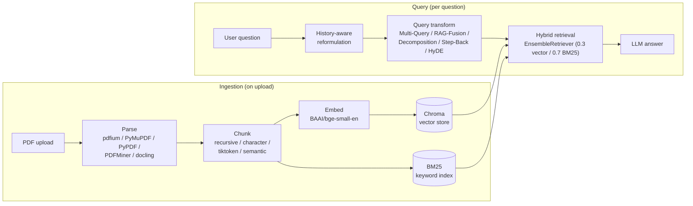
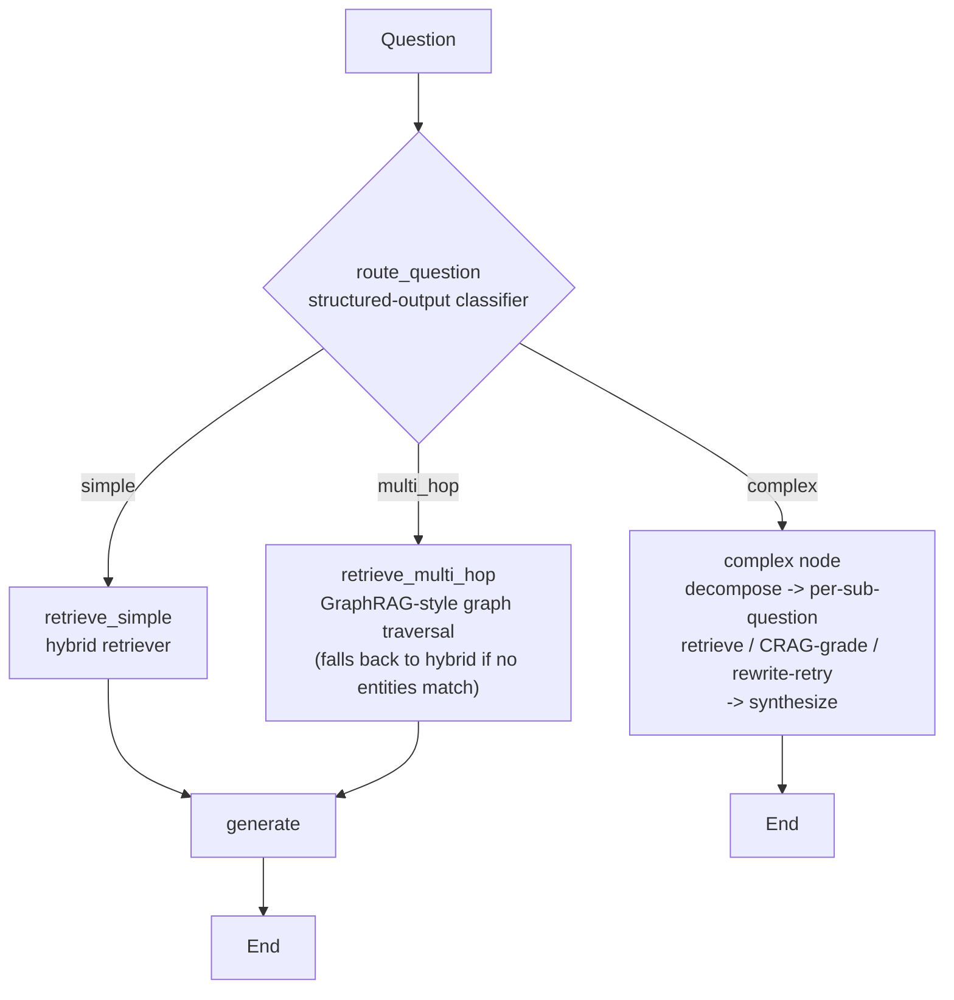

# QA RAG Chat Application

A retrieval-augmented Q&A chatbot for PDF documents that doubles as a RAG technique sandbox: every stage — parsing, chunking, retrieval, query transformation — is swappable at runtime, and an agentic router sits on top that picks a different retrieval strategy per question, including GraphRAG-style multi-hop retrieval and CRAG-style self-correction.

[Live demo](#live-demo) · [Report a bug](../../issues) · [Request a feature](../../issues)

## Table of Contents

- [About The Project](#about-the-project)
- [Architecture](#architecture)
- [What's Actually Built Here](#whats-actually-built-here)
- [Eval, Observability & Testing](#eval-observability--testing)
- [Built With](#built-with)
- [Getting Started](#getting-started)
- [Usage](#usage)
- [Roadmap](#roadmap)
- [Live Demo](#live-demo)
- [License](#license)

## About The Project

Started as a side-by-side comparison sandbox for RAG design choices most tutorials just pick one of — 5 PDF parsers, 4 chunking strategies, 6 query-transformation methods, all switchable from the sidebar. It's grown a second, more production-shaped path alongside that: an agentic router (`agentic_rag.py`) that classifies each question and sends it down the retrieval strategy that actually fits — a single-fact lookup doesn't need the same machinery as a question that requires connecting facts across multiple documents.

- **5 PDF parsing backends** — `pdfium`, `PyMuPDFLoader`, `PyPDFLoader`, `PDFMinerLoader`, `docling`.
- **4 chunking strategies** — fixed-character, recursive-character, token-aware (`tiktoken`), and embedding-based semantic chunking — plus optional **contextual-retrieval chunking** (see below).
- **Hybrid retrieval** — dense vector search (Chroma) + BM25 keyword search via LangChain's `EnsembleRetriever`, weighted 0.3/0.7 toward keyword.
- **Optional cross-encoder reranking** on top of hybrid retrieval.
- **6 query-transformation strategies** in the manual UI path — default, Multi-Query, RAG-Fusion, Decomposition, Step-Back, HyDE.
- **Agentic router** — 3-way question classification (`simple` / `multi_hop` / `complex`), each routed to a different retrieval strategy, including GraphRAG-style multi-hop graph traversal and a bounded CRAG-style grade/rewrite/retry loop.
- **Conversational, history-aware retrieval** in the manual chat path.

## Architecture

**Manual path** — pick a strategy per stage, ask one-off questions:



**Agentic path** (`agentic_rag.py`) — a real LangGraph `StateGraph`, not a linear chain:



The same embedding model (`BAAI/bge-small-en`) is used at both index time and query time throughout — mismatching embedding models between the two silently breaks vector similarity, an easy mistake this avoids by construction (`query_translation.py` is the single source both `app.py` and the retrievers import from).

## What's Actually Built Here

Being specific about the split, since a lot of the plumbing in any RAG app comes from a library:

- **LangChain/LangChain-community provide**: document loaders, text splitters, `Chroma`/`BM25Retriever` wrappers, `EnsembleRetriever`, `MultiQueryRetriever`, `create_history_aware_retriever`, `CrossEncoderReranker` + `HuggingFaceCrossEncoder` for reranking.
- **LangGraph provides**: `StateGraph`, conditional edges — the routing/branching mechanics.
- **RAGAS provides**: the eval metric implementations (faithfulness, answer relevancy, context precision, context recall) — no custom scoring logic.
- **Adapted from published reference techniques, not built from scratch, but genuinely implemented rather than just imported**:
  - *Contextual retrieval* (`contextual_retrieval.py`) follows [Anthropic's published technique](https://www.anthropic.com/news/contextual-retrieval) — same document/chunk prompt template and "prepend context, then embed" pattern as their reference cookbook. Adapted to call the LLM already wired up here (Groq) instead of the Anthropic API directly, which means losing their prompt-caching cost optimization — each chunk is a full LLM call with the whole document in context, meaningfully slower/pricier than plain chunking, which is why it's opt-in.
  - *The agentic router's Adaptive-RAG / CRAG shape* (`agentic_rag.py`) adapts [LangGraph's own published reference notebooks](https://github.com/langchain-ai/langgraph) (`langgraph_adaptive_rag.ipynb`, `langgraph_crag.ipynb`) — same shape: structured-output router, per-document LLM relevance grading, a conditional edge deciding generate vs. rewrite-and-retry.
- **Fully custom, built for this project specifically**:
  - GraphRAG-style multi-hop retrieval (`graph_retrieval.py`) — LLM-extracted (entity, relation, entity) triples assembled into a NetworkX `MultiDiGraph`, with query-time entity matching and bounded-hop graph traversal to pull in chunks connected to the question's entities, not just chunks that textually resemble it. **Not** Microsoft's `graphrag` package — that ships its own indexing pipeline (Leiden community detection, hierarchical summarization) built for large corpora; this implements the same conceptual technique directly on this repo's existing LangChain/NetworkX stack, at a scope that's actually exercisable and verifiable here. Worth knowing before relying on it: entity linking at query time is a plain case-insensitive substring match against known graph node names, not an embedding-based linker — a deliberate scope simplification, not a production entity-resolution system.
  - The reciprocal-rank-fusion function for RAG-Fusion, the query-decomposition/step-back prompt chains, the runtime strategy-selection layer, and the hybrid-retrieval weighting choice (0.3/0.7) itself.
  - The `rag_pipeline.py` module that both the interactive app and the eval/CI harness share, so eval numbers reflect the same code path a user actually hits — not a separate, divergent "eval version" of the pipeline.

## Eval, Observability & Testing

- **RAGAS eval harness** (`eval/run_eval.py`) — a fixed 12-question test set against 2 fixture documents, scored on faithfulness, answer relevancy, context precision, and context recall. Runs against any of 3 modes (baseline hybrid, `--contextual --rerank`, or `--agentic`) so they're directly comparable, and is wired into CI (`.github/workflows/eval.yml`) gated at a 0.7 threshold per metric.
- **No published baseline numbers yet** — the eval harness is real and runs end-to-end, but scoring it requires a live LLM call per question (both for generation and for RAGAS's own LLM-graded metrics), and CI doesn't have `OPENAI_API_KEY`/`GROQ_API_KEY` configured yet. This section will get real numbers instead of this paragraph once that's set up — reporting a fabricated score would defeat the point of having the eval harness at all.
- **Langfuse tracing** (`observability.py`) — wired via LangChain's own callback integration, no hand-rolled span bookkeeping. Every node in the agentic router forwards its `config` into nested calls, so a full agentic run (route → retrieve/grade/rewrite → generate) shows up as one nested trace, not disconnected spans. Falls back to no-op cleanly if `LANGFUSE_*` env vars aren't set — tracing is opt-in, not required to run the app.
- **Cost/latency tracking** (`cost_tracking.py`) — token-usage-to-USD estimation and p50/p95 latency percentiles for the eval report. **In progress as of this README**: the module exists and works, but isn't merged into the observability/eval integration yet.
- **24 pytest tests** across parsing, chunking, graph construction/traversal, the shared pipeline, reranking, and the agentic router (`tests/`), run in CI on every push/PR (`.github/workflows/tests.yml`).
- **A real bug this testing discipline caught**: the LLM-selector dropdown in the UI read a value but nothing downstream ever consulted it — every chain was built once at import time against one hardcoded model, so switching the dropdown did nothing. Fixed by turning the module-level chain objects into `build_*(llm)` functions and threading the selected model through; validated with two fake chat models standing in for different real ones, confirming the selection actually reaches the chain.

## Built With

[](https://www.python.org/)
[](https://www.langchain.com/)
[](https://www.langchain.com/langgraph)
[](https://streamlit.io/)
[](https://www.trychroma.com/)
[](https://networkx.org/)
[](https://docs.ragas.io/)
[](https://langfuse.com/)
[](https://groq.com/)
[](https://www.docker.com/)

## Getting Started

### Prerequisites

- Python 3.10+
- An OpenAI and/or Groq API key, depending on which LLM you select
- Optional: a Langfuse account (public/secret key) for tracing; the app runs fine without one

### Installation

```bash
git clone https://github.com/ravivarmapatturi/qa_rag_application.git
cd qa_rag_application
pip install -r requirements.txt
```

Create a `.env` file in the project root:

```
OPENAI_API_KEY=your_key_here
GROQ_API_KEY=your_key_here
# optional
LANGFUSE_PUBLIC_KEY=your_key_here
LANGFUSE_SECRET_KEY=your_key_here
```

Run the interactive app:

```bash
streamlit run app.py
```

Run the test suite:

```bash
pip install -r requirements-dev.txt
python -m pytest tests/ -v
```

Run the eval harness (requires an API key; see [Eval, Observability & Testing](#eval-observability--testing)):

```bash
pip install -r eval/requirements-eval.txt
python eval/run_eval.py --agentic --report eval/results/agentic.json
```

## Usage

**Manual path**: upload PDFs, pick a parsing/chunking/prompting strategy and LLM from the sidebar, ask questions. Follow-ups are automatically reformulated against the conversation before retrieval runs.

**Agentic path**: ask a question; the router classifies it and picks the retrieval strategy — no manual strategy selection needed. A relational/multi-hop question ("how does X relate to Y") pulls in GraphRAG-style traversal; an ambiguous or multi-part question gets decomposed into sub-questions, each independently retrieved and CRAG-graded before a final synthesis step.

## Roadmap

- [ ] Configure `OPENAI_API_KEY`/`GROQ_API_KEY` in CI and publish the first real eval baseline (currently the biggest gap — see [Eval, Observability & Testing](#eval-observability--testing))
- [ ] Merge cost/latency tracking into the observability integration (code exists in `cost_tracking.py`, not yet wired end-to-end)
- [ ] Upgrade entity linking in `graph_retrieval.py` beyond substring matching, if multi-hop retrieval quality on the eval set turns out to need it
- [ ] Add a license file

See the [open issues](../../issues) for the full list.

## Live Demo

[github.io portfolio link] — *(currently being fixed: the previous demo deployment sat behind a Streamlit auth wall; redeploy in progress.)*

## License

No license file is currently included in this repository.
