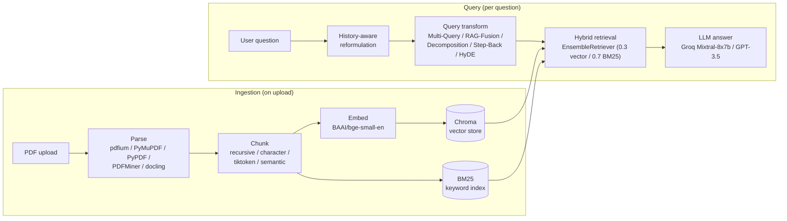

# QA RAG Chat Application

A retrieval-augmented Q&A chatbot for PDF documents, built to compare RAG design choices side by side rather than lock in one — every stage of the pipeline (parsing, chunking, retrieval, query transformation) is swappable at runtime from the UI.

[Live demo](#live-demo) · [Report a bug](../../issues) · [Request a feature](../../issues)

## Table of Contents

- [About The Project](#about-the-project)
- [Architecture](#architecture)
- [What's Actually Built Here](#whats-actually-built-here)
- [Built With](#built-with)
- [Getting Started](#getting-started)
- [Usage](#usage)
- [Roadmap](#roadmap)
- [Live Demo](#live-demo)
- [License](#license)

## About The Project

Most RAG tutorials pick one chunker, one parser, one retrieval strategy, and call it done — which makes it hard to see *why* a given RAG pipeline behaves the way it does. This project turns each of those decisions into a configurable option so the tradeoffs are visible and testable against the same document, in the same session:

- **5 PDF parsing backends** — `pdfium`, `PyMuPDFLoader`, `PyPDFLoader`, `PDFMinerLoader`, `docling` — because parser choice measurably changes what text (and table structure) actually reaches the index.
- **4 chunking strategies** — fixed-character, recursive-character, token-aware (`tiktoken`), and embedding-based semantic chunking.
- **Hybrid retrieval** — dense vector search (Chroma) combined with BM25 keyword search via LangChain's `EnsembleRetriever`, weighted 0.3/0.7 toward keyword — not vector search alone.
- **6 query-transformation strategies** — default, Multi-Query, RAG-Fusion (reciprocal rank fusion), Decomposition, Step-Back prompting, and HyDE — selectable per question.
- **Conversational, history-aware retrieval** — follow-up questions are reformulated against chat history before retrieval runs, so "what about the second one?" resolves correctly.

## Architecture



The same embedding model (`BAAI/bge-small-en`, via `HuggingFaceBgeEmbeddings`) is used at both index time and query time on purpose — mismatching embedding models between the two silently breaks vector similarity, which is an easy mistake in RAG pipelines that this one avoids by construction (`query_translation.py` is the single source for the embeddings instance both `app.py` and the retrievers import).

## What's Actually Built Here

Being specific about the split, since most of the heavy lifting in any RAG app comes from LangChain:

- **LangChain/LangChain-community provide**: the document loaders, text splitters, `Chroma`/`BM25Retriever` wrappers, `EnsembleRetriever`, `MultiQueryRetriever`, and `create_history_aware_retriever`.
- **Built for this project**: the reciprocal-rank-fusion re-ranking function for RAG-Fusion (`query_translation.py::reciprocal_rank_fusion`), the query-decomposition and step-back prompt chains, the runtime strategy-selection layer that lets parsing/chunking/retrieval/prompting each be swapped independently from the UI, and the hybrid-retrieval weighting itself (LangChain gives you `EnsembleRetriever`; picking 0.3/0.7 and wiring both retrievers into it is this project's call).

## Built With

[](https://www.python.org/)
[](https://www.langchain.com/)
[](https://streamlit.io/)
[](https://www.trychroma.com/)
[](https://groq.com/)
[](https://www.docker.com/)

## Getting Started

### Prerequisites

- Python 3.10+
- An OpenAI and/or Groq API key, depending on which LLM you select

### Installation

```bash
git clone https://github.com/ravivarmapatturi/qa_rag_application.git
cd qa_rag_application
pip install -r requirements.txt
```

Create a `.env` file in the project root:

```
OPENAI_API_KEY=your_key_here
GROQ_API_KEY=your_key_here
```

Run it:

```bash
streamlit run app.py
```

## Usage

1. Upload one or more PDFs from the sidebar.
2. Pick a **parsing strategy**, **chunking strategy**, and **LLM** — the app indexes the documents once per session using that combination.
3. Pick a **prompting method** (Multi-Query, RAG-Fusion, Decomposition, Step-Back, or HyDE) to control how your question is transformed before retrieval.
4. Ask questions in the chat box. Follow-up questions are automatically reformulated against the conversation so far before retrieval runs.

## Roadmap

- [ ] Add a retrieval-quality eval harness (this project doesn't currently report accuracy/latency numbers per strategy combination — that's the gap to close next, not something to claim without measuring it)
- [ ] Reranking stage (cross-encoder) after hybrid retrieval, before the LLM call
- [ ] Persist per-session strategy choices so results across strategies can be compared side by side instead of one at a time

See the [open issues](../../issues) for the full list.

## Live Demo

[github.io portfolio link] — *(currently being fixed: the previous demo deployment sat behind a Streamlit auth wall; redeploy in progress.)*

## License

No license file is currently included in this repository.
